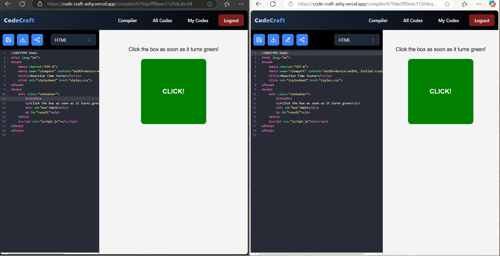

# CodeCraft Compiler

A powerful online code compiler built with React, Node.js, and WebSockets for real-time execution and collaboration.

## 🚀 Live Demo

🔗 [Try it now](https://code-craft-ashy.vercel.app)

## 🛠 Features

- 💻 Supports multiple programming languages
- ⚡ Real-time execution
- 🤝 Collaborative coding with WebSockets
- 📄 Code persistence
- 🎨 Modern UI for an intuitive experience

## 🎥 Demo GIF

## 🔧 Tech Stack

- **Frontend:** React, Tailwind CSS, ShadCN UI, CodeMirror, TypeScript, Zod, and Redux Toolkit
- **Backend:** Node.js, Express, MongoDB, and TypeScript
- **Real-Time:** Socket.IO
- **Deployment:** Vercel for frontend and Render for backend

## 📜 Usage

1. Choose a programming language. 👩🏻‍💻
2. Write and execute code in real-time. 🎨
3. Save your code in the database or download it locally. 💾
4. Share your session with your friends for real-time collaboration and make awesome projects. 🎉

## 🛠 Contributing

Contributions are welcome! Feel free to fork this repository, make improvements, and submit a pull request.

## 📜 License

This project is licensed under the MIT License.

## 📬 Contact

For any issues or feature requests, open an issue on GitHub.
